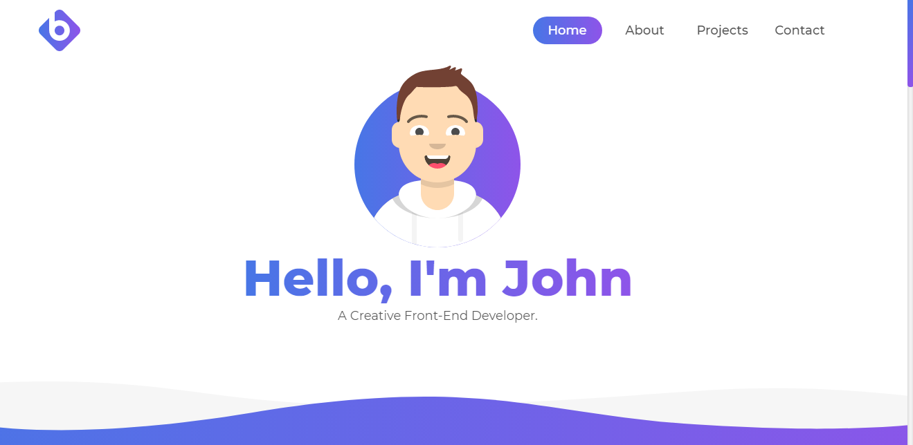

# Modern Portfolio V1

This was my first portfolio ever built.

## Preview
* [Live Preview](https://)

## Installing
Being just a static template, all you need to do is to `Clone/Download` this repository into your machine and then open `index.html` using your browser.

## Technologies Used
* [Bootstrap 3](https://getbootstrap.com/docs/3.3/)
* [JQuery](https://jquery.com/)
* [Google Fonts](https://fonts.google.com/)

## License
This project is licensed under the MIT License - see the [LICENSE.md](LICENSE.md) file for details